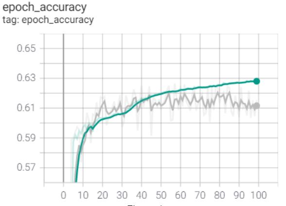
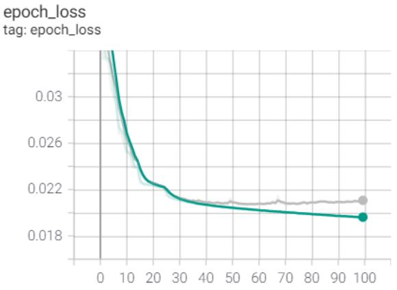
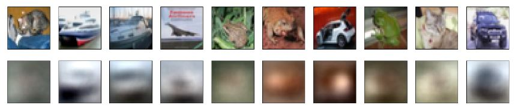
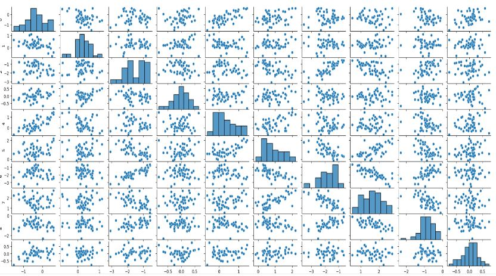
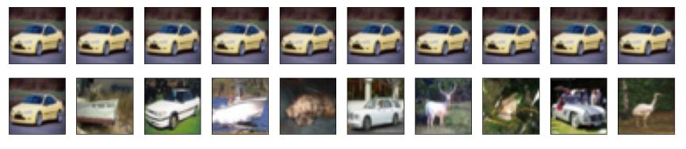

# AutoEncoder based Image Retrieval System

### Dataset Preperation

The CIFAR-10 dataset contains 60000 images 32 x 32 color images in 10 classes, with 6000 images per class. There are 50000 training images and 10000 test images.
We used keras.datasets library to load the images. Since we are dealing with color images, each image will have 3 channels (Red,Green & Blue) and each channel will have pixel values in the range of [0 - 255]. To speed up the training and for faster convergence we convert all these values in the image array to be in the range of [0-1]. To achieve this we divide each value in the image array with 255.0. Since in its initial form the values stored in the image array are of type uint8, we have changed it to float32 type before performing the division. Otherwise, the division will result in erroneous results.

Run the **DataPreperation.py** file in this repository to perform the data preperation.

### Building AutoEncoder

AutoEncoders uses an unsupervised approach for learning a lower-dimensional feature representation from unlabeled training data. The encoder block learns the mapping from the input data to a low-dimensional latent space z. Having a low dimensional latent space allows to compress the data into small latent vector which learns a very compact enrich feature representation. Decoder learns mapping back from latent space z, to a reconstruct the original data.

Autoencoders are trained using the reconstruction loss, where we compare the difference between the orginal image and the reconstructed image from the decoder. The reconstruction loss forces the latent representation to capture as much "information" about the data as possible.

We tried different architectures for both the encoder and the decoder before selecting the architecture which we felt gave us the best result. Initially, we tried with just one hidden dense layer. Then we iteratively kept adding more conv2D layers followed by max-pooling layers and kept on checking both the accuracy scores and the results of the sanity check plots. Some architecture gave us slightly better accuracy, but the sanity check results were not good. For instance, we tried an architecture where we stacked 2 conv2D layers and then added a max pooling layer. We added 3 more of these stacked layers in our encoder and retrained the model. Even though this stacked architecture (trained with 25 epochs) gave a better accuracy but the projected latent values had less number of clusters for images belonging to the same data class and image data was more widely distributed across the space. And even when we extracted similar images using the encoder model, the results were not satisfactory. Hence we decided to abandon this architecture. Similarly we tried some different architectures before fixing on the below one(figure 2 and figure 3). Additionally we also used the python library ‘hyperopt’ to fine tune the hyper parameter like number of hidden units in each layer. Since the library was giving the best results for hyperparameters solely based on the metric like accuracy or loss, after a while we stopped using it. This was because we had to also consider the visualization of different sanity checks to choose the best model that captures the most important features in the 10 dimensional latent space. We used the hyper parameters we got while tuning with hyperopt as the base and changed it manually and retrained to see how the change is impacting the results during sanity check.  

The intuition for adding conv2D layers was to capture the local features like edges from the input image. And the intuition for adding the max pooling layer was to downsample the input image so as to get the most important global features from the feature map created by the conv2D layers. It also helped to reduce the size of the input to the next layer.

During the training process, we used different optimizers and loss functions to see which gave us the best result. The ‘adam’ optimizer and the ‘mse’ loss function were giving us the best results. Hence we decided to use them for the final model as well.

We also tried using different activation functions like ‘relu’ and ‘sigmoid’ during the training process. We were getting the best results with relu. And while changing the activation functions during training, we closely monitored the pair plot which plots the distribution of latent space. We got some good distributions while using relu as the activation function for our autoencoder model.

During the training process we also observed that, for most of the models after around 12 epochs, the accuracy reached around 60 and from there the improvement in accuracy was very less.

**BuildingAutoencoder.py** contains the final code for our building and saving the autoencoder model.

### Training AutoEncoder

Once we had finalized the hyperparameters during the iterative training process, we ran the final training for 100 epochs. Additionally, the two callbacks that we introduced during the training process assisted us in logging and saving the best model. For saving the best model, we monitored the ‘val_loss’ metric with the value of mode as ‘min’. This was because, in our epoch vs loss plot, we observed that the validation loss was still decreasing with more epochs compared to other metrics. We used tensorboard to visualize the epoch vs accuracy & loss plots generated from the logs saved using the TensorBoard callback.

While observing the epoch vs accuracy plot we saw that after around 80 epoch the was decreasing little while the training accuracy was increasing. But since the difference of accuracy values were training and the validation was not very high, we concluded it was not a case of overfitting. The highest difference between them was at 100 epoch. Training accuracy was 63 and validation accuracy was 61. The difference was only 2. The epoch vs loss plot also had the same trend after 80 epochs.

Below figures have the epoch vs accuracy plot and epoch vs loss plot.

### Sanity Check

In this step, we evaluated the results of our model to understand how well our model was performing to solve the task sufficiently. We executed the tasks in this step many times during the training process of our model. During the training process, after the model is created during each iteration, we plot the visualization to see how well the model works. And based on these results we made the changes to the model architecture.

 **SanityCheck.py** can be run to recreate the results.

 #### Check 1: Visualizing the reconstruction results

 Here we evaluate the results of the autoencoder model. We picked the first 10 images from the test dataset for this test. After loading the saved autoencoder model from the file system, we used the predict method of the keras.model to get the decoded image array. We passed the first 10 images from the test dataset to the loaded autoencoder model to create the decoded values.

 Now using the matplot library, we plotted the original images and the reconstructed images from the decoded values as various subplots. After retraining the model we had always used to execute this step to see how well the original images are reconstructed by our model.
The reconstruction quality was not great since our latent space was only 10 dimensions. But still some parts of the reconstructed images were recognizable.

Reconstruction results of the 10 images are shown below:

#### Check 2: Distribution Analysis

Here we encoded random 50 images from the test dataset using the encoder model which was saved during the training. These encoded 10 dimensional vectors were visualized as pair plots using seaborn library. During the training we had a close look at this distribution. It assisted us in fine tuning the parameters like activation function. We specifically paid attention to how well the vectors were distributed.

Pair plots are shown in the below figure:

#### Check 3: Projection of Test Images

In this task we visualized the UMAP scatterplot for the images in the test dataset. We assigned specific colors to images belonging to the same class. At the end of the training process we observed this plot to see how separated the images belonging to different classes are. We have some clusters where images from a particular data class dominate. On the other hand images of a few data classes were very sparsely distributed in the plot. We observed this plot regularly and made changes to the hyper parameters to see how it impacts the scatterplot.

### Data querying

Here we used the saved encoder model to generate 10 dimensional encodings for all the 60000 images (train + test data sets). Additionally we created the query images by picking 20 random images from the test dataset. We calculated the pairwise distance similarity between the both and picked the 10 most similar images.

We used the following three distance measures: Euclidean distance, Cosine distance, Manhattan distance.

For all three we plotted the 10 similar images for each query image and eyeballed their visual similarity. We observed that cosine similarity was giving better results compared to other distance measures.

To further check which distance measure was giving us the best result, we picked 10 images from the test dataset which belonged to the same data class .Here the assumption we have made is that the images belonging to the same data class should be more similar and hence the distance between them should be less. Next we computed the distances using the three methods and plotted the pairwise similarity using the ‘plotly’ library (visualization and code not included in the submission since the library was not mentioned in the assignment sheet). Even from this plot we observed that cosine distance has a better result compared to others. We repeated the same process for 5 more data classes. 

The jupyter notebook **DataQuerying.ipynb** contains the code necessary to perform the data querying.

Sample of the data query result is shown in the below figure.
In the first row you have the input image and in the second row you have the top 10 similar images computed using the image embedding from the encoder.

